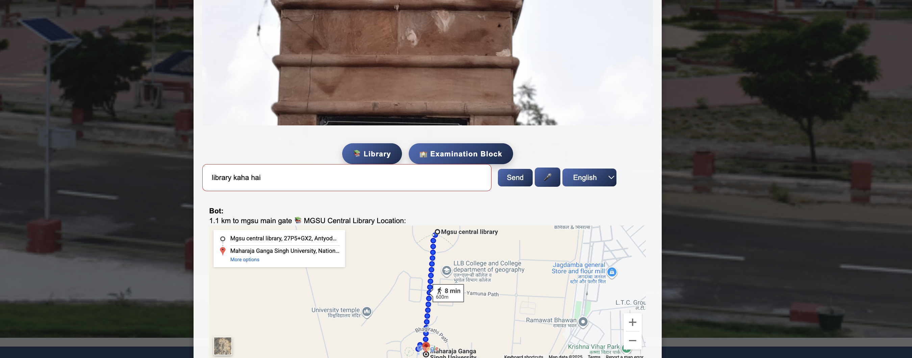

# MGSU Chatbot


---

## Overview
**MGSU Chatbot** is an intelligent chatbot designed for **Maharaja Ganga Singh University (MGSU)**.  
It provides quick information to students and staff about university buildings, syllabus, events, and other queries via a simple chat interface.

---

## Features
- 💬 **Chat Interface**: Ask questions and get instant responses.
- 🗣️ **Voice Support**: (Optional) Interact using voice commands.
- 💾 **Chat History**: Keep track of previous conversations.
- 🌐 **Multi-language Support**: Supports Hindi and English.
- 📘 **Syllabus Download**: Download syllabus PDFs.
- 🛠️ **Admin Panel**: Manage queries, view chat history, update responses.
- 📆 **Event Calendar**: View upcoming events at MGSU.

---

## Screenshots

**Home Page / Chat Interface**  


**chatbot Panel**  


**chatbot panel**  


> *Note: Replace `screenshots/...` with actual image paths from your project.*

---
Contributing :
Add new intents
Improve the chatbot AI
Enhance the UI/UX
Add new features like notifications or event reminders


## Installation

1. Clone the repository:
```bash
git clone https://github.com/username/mgsuchatbot.git

cd mgsuchatbot
pip install -r requirements.txt
python aap.py
Open your browser and go to http://127.0.0.1:5000/.

File Structure
mgsuchatbot/
│
├─ aap.py               # Main Flask app
├─ chatbot.py           # Chatbot logic
├─ intents.json         # Predefined intents & responses
├─ templates/           # HTML templates
├─ static/              # CSS, JS, images
├─ screenshots/         # Screenshot images for README
└─ README.md
